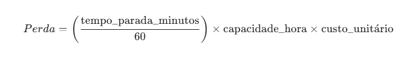
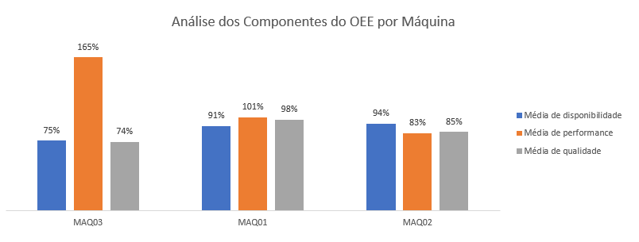
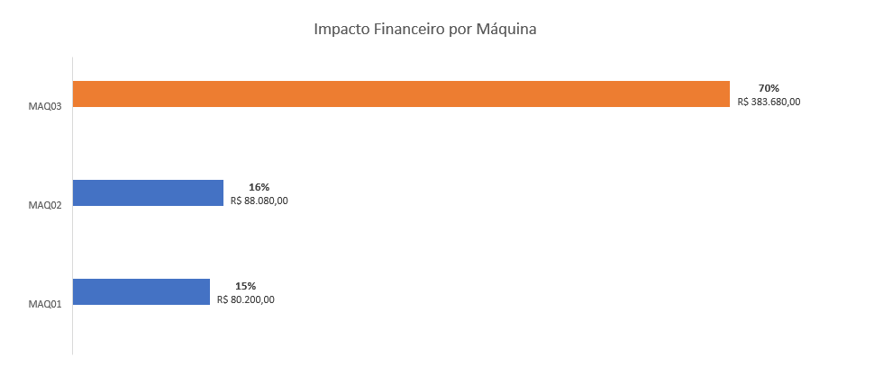
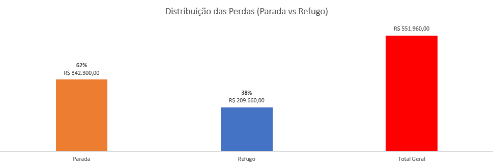

# 🏭 Eficiência Industrial: O Custo Invisível do Desequilíbrio Operacional

## 📌 Visão Geral do Projeto
Este projeto apresenta uma análise diagnóstica profunda sobre a eficiência de uma base produtiva industrial. O objetivo central foi transitar da simples visualização de máquinas rodando para uma **perspectiva estruturada de dados**, identificando gargalos operacionais e mensurando o impacto financeiro real das paradas e perdas de performance.

A análise revelou um prejuízo total de **R$ 552.960,00** no período analisado, fornecendo dados críticos para a tomada de decisão estratégica e recuperação de margem.

---

## 🛠️ Engenharia de Dados e ETL
Para garantir a confiabilidade analítica, foi desenvolvido um pipeline robusto em **Linguagem M**, garantindo que o cálculo de indicadores complexos ocorra diretamente na camada de preparação dos dados.

### **Destaques da Modelagem:**
* **Validação de Integridade:** Verificação automática entre produção total e soma de itens bons/refugados.
* **Cálculo Nativo do OEE:** Implementação lógica das três dimensões (Disponibilidade, Performance e Qualidade).
* **Tratamento Monetário:** Conversão de tipos de dados com localidade (`en-US`) e ajuste de precisão decimal para custos.

---

## 📖 Repositório de Scripts (Linguagem M)
Neste repositório, disponibilizei duas abordagens do pipeline de dados para demonstrar diferentes necessidades técnicas:

1. **`pipeline_transformacao_producao_oee.m` (Versão Portfólio):** Código extensamente documentado e comentado. Ideal para auditoria de fórmulas, aprendizado e demonstração de boas práticas de desenvolvimento.
2. **`pipeline_transformacao_producao_oeeV2.m` (Versão Produção):** Versão enxuta e otimizada para máxima performance de processamento no motor do Power Query.

---

## 📊 Diagnóstico de Eficiência (OEE)
A decomposição dos indicadores revelou disparidades críticas entre as máquinas e turnos:

* **Instabilidade na MAQ03:** Esta unidade concentra o maior volume de perdas. Sua performance atinge picos de 204% no turno da tarde, sugerindo erro de parametrização ou aceleração excessiva para compensar paradas.
* **Impacto Financeiro:** A MAQ03 é responsável por **70% do prejuízo total**, totalizando R$ 383.680,00.

---

## 💡 Insights Estratégicos e RH
* **Gargalo Humano:** No Turno da Noite, **100% dos 262 minutos de parada** foram causados por **Falta de Operador Treinado**, validando a necessidade de um programa de capacitação urgente.
* **Distribuição de Perdas:** As paradas de máquina (Indisponibilidade) representam **62%** do prejuízo financeiro, superando as perdas por qualidade (38%).

---

## 📂 Organização do Repositório
* **`/Dados`**: Base original `Base_Analitica_Producao.csv`.
* **`/imagens`**: Gráficos de performance, dashboards e fórmulas.
* **`/scripts`**: Versões comentada e otimizada da lógica M.

---

### Como reproduzir:
1. Carregue o arquivo CSV da pasta `/Dados`.
2. No Power BI/Excel, abra o Editor Avançado do Power Query.
3. Utilize o conteúdo da pasta `/scripts`, ajustando o caminho da `Fonte` para o seu diretório local.
